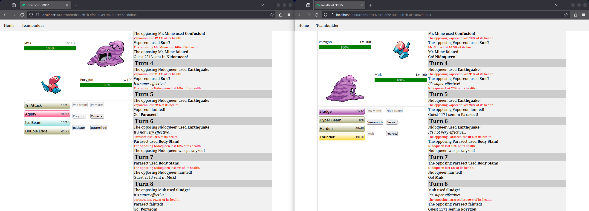

# Standoff

Standoff is a Pokemon battle simulator for the Generation 1 (Pokemon Red, Blue, and Yellow) games.



## Setup

First, install the dependencies
```bash
# npm
npm install
# pnpm
pnpm install
# yarn
yarn install
# bun
bun install
```

Start the development server on `http://localhost:3000`:
```bash
# npm
npm run dev
# pnpm
pnpm run dev
# yarn
yarn dev
# bun
bun run dev
```

## Production

Build the application for production:

```bash
# npm
npm run build
# pnpm
pnpm run build
# yarn
yarn build
# bun
bun run build
```

Locally preview production build:

```bash
# npm
npm run preview
# pnpm
pnpm run preview
# yarn
yarn preview
# bun
bun run preview
```
